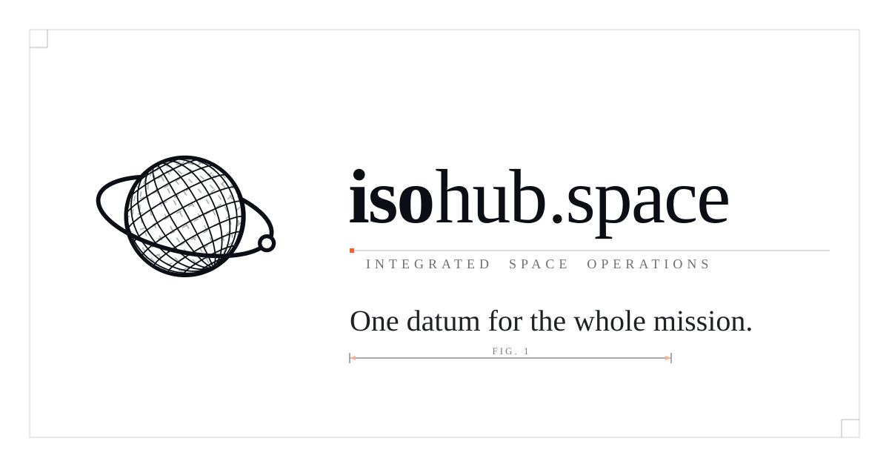

<!-- Committed copies of isohub-brand's brand/social/og-card{,-light}.svg —
     the brand repo is private, so hotlinking its raw URLs would render broken
     for visitors. Re-copy from the brand repo when the masters change. -->
<picture>
  <source media="(prefers-color-scheme: dark)" srcset="assets/og-card.svg">
  
</picture>

# isohub.space — Space Open Platform

Open-source, cloud-native SaaS platform for space operations: orbital
mechanics, spacecraft simulation, mission planning, telemetry, and reference
data — a multi-tenant, hexagonal-architecture microservice suite.

**Start here:**

- 🚀 [`isohub`](https://github.com/isohub-space/isohub) — the application monorepo: what the platform does and how to build and run it.
- 📚 [`isohub-docs`](https://github.com/isohub-space/isohub-docs) — the knowledge corpus: ADRs, architecture views, research, governance — and the **canonical map of every repository in this org**.

Everything else (infrastructure, brand, assets, lab tools) is one hop from
that map. Security reports: private vulnerability reporting via the *Security*
tab of the affected repository — see the org
[SECURITY.md](https://github.com/isohub-space/.github/blob/main/SECURITY.md).
